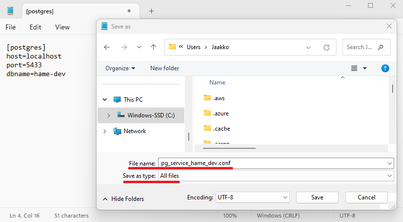
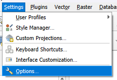
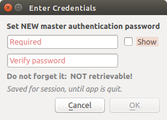
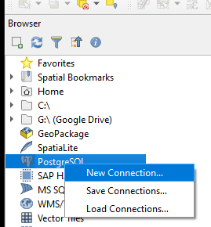
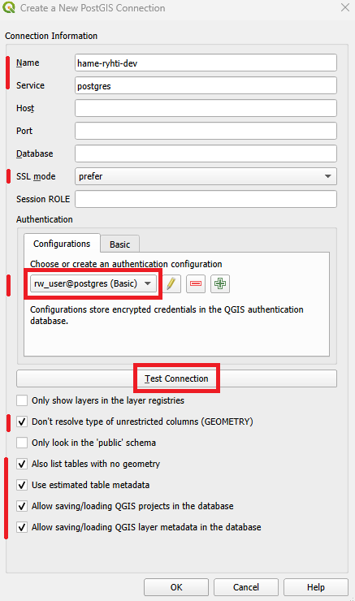

# ARHO-Ryhti

[](https://github.com/GispoCoding/hame-ryhti/actions/workflows/tests.yml)
[](https://github.com/GispoCoding/hame-ryhti/actions/workflows/code-style.yml)
[](https://github.com/GispoCoding/hame-ryhti/actions/workflows/deploy.yml)
[](https://github.com/pre-commit/pre-commit)

---

[Ryhti-yhteensopiva](https://ryhti.syke.fi/alueidenkaytto/tietomallimuotoinen-kaavoitus/) ARHO-kaavoitustietokanta, joka käyttää [kansallisia Ryhti-rajapintoja](https://ryhti.syke.fi/tietoa-jarjestelmasta/miten-tieto-liikkuu/). Tietokantaa voi käyttää QGISillä, johon on asennettu [ARHO-kaavoituslisäosa](https://github.com/GispoCoding/arho-feature-template). Tietokanta ja sen tarvitsemat funktiot toimivat AWS (Amazon Web Services) -pilvialustalla.

---

ARHO land use planning database compatible with [national Ryhti data model](https://ryhti.syke.fi/alueidenkaytto/tietomallimuotoinen-kaavoitus/), connecting to [national Ryhti APIs](https://ryhti.syke.fi/tietoa-jarjestelmasta/miten-tieto-liikkuu/). The database may be used with QGIS with [ARHO land use planning plugin](https://github.com/GispoCoding/arho-feature-template). The database and required functions work on AWS (Amazon Web Services) cloud platform.

- [Architecture](#architecture)
- [Data model](#data-model)
- [Development requirements](#development-requirements)
- [Development](#development)
  - [Database and functions](#database-and-functions)
  - [Database changes](#database-changes)
  - [Adding requirements](#adding-requirements)
- [Connecting to the test database](#connecting-to-the-test-database)
  - [Creating SSH key pairs](#creating-ssh-key-pairs)
  - [Opening an SSH tunnel to the server](#opening-an-ssh-tunnel-to-the-server)
  - [Connecting to the database from QGIS](#connecting-to-the-database-from-qgis)

## Architecture

ARHO-Ryhti consists of
1. a PostGIS database,
2. various AWS Lambda functions to manage the database and import or export planning data,
3. [X-Road security server sidecar container](https://gofore.com/en/benefits-of-the-x-road-security-server-sidecar/) to connect to Ryhti through Finnish X-Road, and
4. [QGIS plugin](https://github.com/GispoCoding/arho-feature-template) to connect to the database and create regional land use plans.


To manage ARHO-Ryhti AWS resources, check the [infra README](https://github.com/GispoCoding/hame-ryhti/blob/main/infra/README.md#hame-infra) in the infra directory.

## Data model


To look closer at our data model, check the autogenerated [data model documentation](https://github.com/GispoCoding/hame-ryhti/blob/main/dbdoc/viewpoint-0.md) in the dbdoc directory.

## Development requirements

- Python 3.13
- Docker (Install Docker based on [your platform's instructions](https://docs.docker.com/get-started/#download-and-install-docker).)

## Development

1. Create a Python virtual environment and activate it.
2. `pip install pip-tools`
3. `pip-sync requirements.txt requirements-dev.txt`
4. `pre-commit install`
5. Copy `.env.dev` to `.env`. This file contains example environment variables used in development.

If you also want to test Ryhti API client, you have to

6. Register to [SYKE API portal](https://api-developer.ymparisto.fi) and subscribe to their Ryhti product. Your subscription details will contain your Ryhti API key.
7. Insert your Ryhti API key at SYKE_APIKEY line in `.env` file. Do *not* modify `.env.dev`, it is committed in github and should only contain public example data, not your actual api key.

If you also want to import municipality and region boundaries from [MML](https://www.maanmittauslaitos.fi/), you have to

8. Register to [MML](https://www.maanmittauslaitos.fi/rajapinnat/api-avaimen-ohje) and create a new API key for MML APIs.
9. Insert your MML API key at MML_APIKEY line in `.env` file. Do *not* modify `.env.dev`, it is committed in github and should only contain public example data, not your actual api key.

To start and create a database:

10. Start the development containers with `make up` (or `docker-compose -f docker-compose.dev.yml up -d`).
11. Fill the database with current data model by `make test-create-db`.
12. Populate national code tables from [koodistot.suomi.fi](https://koodistot.suomi.fi) by `make test-koodistot`. (If you have not specified an MML API key, code tables will be populated, but municipality and regional geometries will be left empty, and you will get an error telling you that MML API key is missing.)

> To stop development containers use `make stop`. To delete containers and the database volume use `make down`.

> To create plans in the database, you must add at least one `organization` to the organization table (i.e. a test region or test municipality), with foreign key to the national code table which contains the geometry of your region or municipality. All plans that you create must have a foreign key to a valid region or municipality.

### Tests

 Run tests with `pytest`. (If you have not specified a Ryhti API key, some `test_services` will fail, because some Ryhti client tests try out calling the SYKE Ryhti open validation API.)

If test using pytest-docker get stuck, you can remove the dangling containers with:

```shell
docker ps --format '{{.Names}}' |grep pytest | awk '{print $1}' | xargs -I {} docker stop {}
docker ps --format '{{.Names}}' |grep pytest | awk '{print $1}' | xargs -I {} docker rm {}
docker network ls --format {{.Name}} |grep pytest | awk '{print $1}' | xargs -I {} docker network rm {}
```

Once you have created plan data in the database, you may test calling the SYKE Ryhti open validation API with your database contents with `make test-ryhti-validate`.

### Database changes

1. Database is defined using SQLAlchemy, so familiarize yourself with [SQLAlchemy declarative style](https://docs.sqlalchemy.org/en/20/orm/declarative_tables.html).
2. Database is divided into two schemas: `codes` contains all the Ryhti specific [national code lists](https://ryhti.syke.fi/ohjeet-ja-tuki/tietomallit/), while `hame` contains all the data tables (plans, plan objects, plan regulations etc.).
3. If you want to change *all* tables in a schema (i.e. edit *all* the code tables, or add a field to *all* the data tables), the abstract base classes are in [base.py](./database/base.py).
4. If you only want to change/add *one* code table or one data table, please edit/add the right table in [codes.py](./database/codes.py) or [models.py](./database/models.py).
5. To get the changes tested and usable in your functions, you must have up-to-date test database running with `make test-migrate-db`. When the database is up, you may create a new database revision with `make revision name="describe_your_changes"`, e.g. `make revision name="add_plan_object_table"`. This creates a new random id for your migration, and a revision file `YYYY-MM-DD-HHMM-<id>-add_plan_object_table` in the [alembic versions dir](./migrations/versions). Please check that the autogenerated revision file seems to do approximately sensible things.
    - Specifically, when adding geometry fields, please note [GeoAlchemy2 bug with Alembic](https://geoalchemy-2.readthedocs.io/en/latest/alembic.html#interactions-between-alembic-and-geoalchemy-2), which means you will have to *manually remove* `op.create_index` and `op.drop_index` in the revision file. This is because GeoAlchemy2 already automatically creates geometry index whenever adding a geometry column.
6. Run tests with `pytest` to check that the revision file runs correctly. At minimum, you may have to change the tested table counts (codes_count and hame_count) in [database test setup](./test/conftest.py) to reflect the correct number of tables in the database.
<!-- 8. To update the [database documentation](./backend/databasemodel/dbdoc/README.md) to reflect the changes, install [tbls](https://github.com/k1LoW/tbls) and run `tbls doc --force`. -->
7. Commit your changes and the new revision file in [alembic versions dir](./database/migrations/versions).

#### Adding a new table

Alembic(_utils) is not able to create a new table and triggers for the table in a same migration.

If creating tables with triggers, creation of triggers automatically should be disabled temporarily for those tables:

1. Add a model for new table.
2. Add a temporary exception for the trigger creation in the [triggers.py](database/triggers.py) in the block that defines the hame tables as following (the last line):
```python
# All hame tables
hame_tables = [
    klass.__tablename__
    for _, klass in inspect.getmembers(models, inspect.isclass)
    if inspect.getmodule(klass) == models
    and klass.__tablename__ != "<new table name>"
]
```
3. Run `make revision name="add a new table"` to create a migration file for table creation.
4. Apply the migrations by running `make test-migrate-db`
5. Remove the temporary exception
6. Run `make revision name="add triggers"` to create a migration file for trigger creation.

### Adding requirements

To add new requirements:
1. Add the Python library in requirements.in (if used in production) or requirements-dev.in (if used in development/CI/CD).
2. `pip-compile requirements.in` or `pip-compile requirements-dev.in`
3. `pip-sync requirements.txt requirements-dev.txt`

To update requirements to latest versions:
1. `pip-compile requirements.in --upgrade` and `pip-compile requirements-dev.in --upgrade`
2. `pip-sync requirements.txt requirements-dev.txt`

<!-- ## Data model

[Database documentation](./database/dbdoc/README.md) -->

## Connecting to the AWS database

Connecting to the database is done with the secure shell protocol (SSH). To be able to connect to the database, you will have to
1. Create a SSH key pair on your computer (this has to be done only once)
2. Have db admin add the public key to the server (this has to be done only once)
3. Open a SSH tunnel on your computer (this has to be done each time)

Detailed instructions to these steps are provided below.

### Creating SSH key pairs

Generation of the key pair can be done, for example, with a program called ssh-keygen (available on *Windows 10 and 11, Linux* and *Mac OS*):

- Open a command prompt (for example, open start menu and type 'cmd' and hit enter)
- Type in the command prompt `ssh-keygen -t ed25519` and press enter. This will generate a key pair (using ed25519 algorithm).
Here you could also spesify the name of the key file and passphrase to protect the key (see Fig.). If you accept the defaults, just press enter.

By default the key pair is saved to `<your home folder>/.ssh/`: it contains your public key (id25519.pub), a text file which
you have to provide to the database administrator, and the private key in file `id25519` (without the .pub suffix) which you MUST KEEP PRIVATE AND NOT SHARE IT WITH ANYONE!


### Opening an SSH tunnel to AWS

Once the administrator has added your public key to the server, you can connect to the database using ssh:
- On *Windows*, the easiest way to open the SSH tunnel to the server is by using a batch script named `create_tunnel.vsl.bat` found [here](docs/create_tunnel.vsl.bat) in this repository. Save the file to your computer in a convenient location. After this you can open the tunnel by executing this script by double clicking the file. On *Linux/Mac OS* (or if you want to use a command prompt), just copy-paste the command
```
ssh -N  -L 5433:hame-devdb.ctcspesmxrh1.eu-central-1.rds.amazonaws.com:5432 -D localhost:5443 -i "~/.ssh/id_ed25519" ec2-tunnel@hame-dev.bastion.gispocoding.fi
```
In addition to SSH tunnel to the database, the command creates a socks5 proxy that allows the Arho plugin to connect to the lambda functions in AWS.

- Enter the passphrase for the key (if set) and hit enter. If no error messages appear, the tunnel is connected. Do not close the command prompt window, otherwise the SSH tunnel is disconnected.
- Now you can connect to the database using `localhost` as the host and `5433` as the port. The details how to do this with different software are given in the following sections.
- Additional tips: the connection can automatically terminate, for example, due to server rebooting or network issues (this is usually accompanied by a message, such as `client_loop: send disconnect: Connection reset`). If this happens, simply double click the file again to reopen the tunnel. In case you want to close an open SSH tunnel, press `Ctrl+C` and answer the confirmation by pressing `Y`.

### Connecting to the database from QGIS

The data is read from a PostgreSQL service named `postgres` with a QGIS authentication which id is `ryhtirw`. Here is a way to set up database connection in QGIS:

1. Create a PostgreSQL service file for each environment (at the moment, there is only development environment). The file can be created, for example, with a text editor. Add the following with correct values for each environment:
```ini
[postgres]
host=localhost
port=5433
dbname=hame-dev
```
Save the file to some folder, an example location could be `<your home folder>/hameconfig/`. Name the saved file for example `pg_service_hame_dev.conf` (yes, the suffix '.conf' is part of the file name). Do not save this file as a text file (with a suffix .txt), but instead choose 'All types' from the 'Save as type' dropdown menu.



NOTE: the Postgres service file for the dev environment is also included in in this repository under the docs folder, so alternatively you can copy the file from the into a convenient location on your computer.

2. Create a QGIS-profile for each environment. Name the profile for example `ryhti-hame-dev`. A new QGIS window will open to this profile, use that in the following.


3. In QGIS settings add two environment variables. Add a `PGSERVICEFILE` variable and fill the file path of corresponding service file as a value. Add a second variable `PGTZ` and set the value to your local timezone using the time zone name from [tz database](https://en.wikipedia.org/wiki/List_of_tz_database_time_zones), probably `Europe/Helsinki`. Choose `Overwrite` for both variables in the first column of the variable list.




4. Restart QGIS to make the environment variable to take effect.

5. Create a authentication key to QGIS which ID is `ryhtirw`.

NOTE: you may be prompted for setting a master password in QGIS, if not set earlier. If so, set master password and make sure to save it to a secure place for yourself. The master password is used to manage and access the saved authentication configurations in QGIS (for more information, see the [QGIS Documentation](https://docs.qgis.org/latest/en/docs/user_manual/auth_system/auth_overview.html)).



Now you can proceed with the database authentication details. As in step 3, open `Settings > Options` in QGIS and choose `Authentication` on the left panel. Click the green plus sign to add a new authentication configuration and fill in details as in the following image. It is important to use the authentication Id `ryhtirw` and database username and password here.


6. Create a new PostgreSQL connection



Add the necessary parameters as follows. You can also test the connection at this point and when done, press OK.



7. Open the [ARHO QGIS project](https://github.com/GispoCoding/arho-feature-template/blob/main/qgisprojekti.qgz) in QGIS. It opens up the plan map layers contained in the ARHO database. If you wish, you may save the latest QGIS project version in your ARHO database, so you may edit it if needed and everybody may find the project in the database: Project > Save as... > PostgreSQL...
8. Install the [ARHO QGIS plugin](https://github.com/GispoCoding/arho-feature-template).
