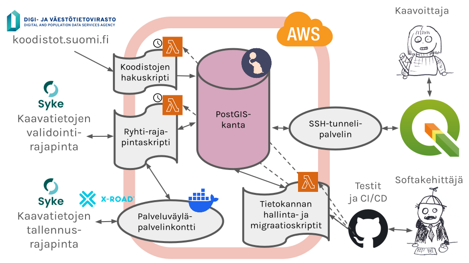

# ARHO Backend infra



- [Setup](#setup)
   - [Multi-factor authentication (MFA)](#multi-factor-authentication-mfa)
- [Managing existing instances](#managing-existing-instances)
   - [Adding ssh tunneling users](#adding-ssh-tunneling-users)
- [Configuring new instances](#configuring-new-instances)
- [Deploying instances](#deploying-instances)
   - [Configuring X-Road (Suomi.fi Palvelyväylä) access](#configuring-x-road-suomifi-palveluväylä-access)
- [Teardown of instances](#teardown-of-instances)
- [Manual interactions](#manual-interactions)

## Setup

Run these steps the first time.

1. Install [Terraform](https://terraform.io) and `aws cli`
2. Create an AWS access key and store it locally in a credentials file (
   see [AWS Configuration basics](https://docs.aws.amazon.com/cli/latest/userguide/cli-configure-quickstart.html#cli-configure-quickstart-config)
   and [Where are the configuration settings stored](https://docs.aws.amazon.com/cli/latest/userguide/cli-configure-files.html)
   for more info)
3. To manage existing instances, install [sops](https://github.com/getsops/sops) to decrypt encrypted variable files in the repository.

### Multi-factor authentication (MFA)

For most AWS accounts, multi-factor authentication (MFA) is required. If you run Terraform with only your access key, you may receive 400 or 403 errors. To set up MFA, install both AWS CLI and `jq`, and ensure both are available in your system path.

Use the [get-mfa-vars.sh](get-mfa-vars.sh) script to obtain temporary MFA session token environment variables. You can either run `source get-mfa-vars.sh` to update your current shell's environment variables directly, or execute `./get-mfa-vars.sh` to generate a file `/tmp/aws-mfa-token` containing the variables, then run `. /tmp/aws-mfa-token` to set them in your shell.

You may set your MFA device ARN in the `AWS_MFA_IDENTIFIER` environment variable. If not set, the script prompts for it. For more details, run `./get-mfa-vars.sh --help`. By default, the MFA session token is valid for 12 hours.

### Terraform workspaces

Use terraform workspaces to manage different deployments. The state of each deployment is stored in a workspace located in an S3 bucket. To list existing workspaces in S3, run `terraform workspace list`. To create a new workspace, run `terraform workspace new your-deployment`. To switch to a workspace, run `terraform workspace select your-deployment`.

## Instance configuration repository

The instance specific configuration (encrypted terraform variable files and encrypted ssh public key lists) lives in the private [GispoCoding/arho-deploy](https://github.com/GispoCoding/arho-deploy) repository, together with the deploy workflows. Clone it as a sibling of this repository:

```
~/projects/arho-backend
~/projects/arho-deploy
```

The make targets in this directory find the configuration through the `ARHO_DEPLOY_DIR` variable, which defaults to `../../arho-deploy`. If your checkout is elsewhere, pass `ARHO_DEPLOY_DIR=/path/to/arho-deploy` to make. A sample variable file [var-files/arho.tfvars.sample.json](var-files/arho.tfvars.sample.json) remains in this repository as a template.

## Managing existing instances

To manage existing instances, activate the corresponding terraform workspace e.g. `terraform workspace select <workspace>` and decrypt the encrypted variable file by running `make decrypt-workspace-secrets`.

To make changes to instances, first check that your variables and current infra is up to date with terraform state:

```shell
terraform init
make tf-plan
```

This should report that terraform state is up to date with infra and configuration. You may make changes to configuration or variables and run `make tf-plan` again to check what your changes would mean to the infrastructure.

When you are sure that you want to change AWS infra, run

```shell
make tf-apply
```

Please verify that the reported changes are desired, and respond `yes` to apply the changes to infrastructure.

Remember to commit any changes you made to the terraform configuration. If you changed any variables, run `make encrypt-workspace-secrets` and commit the encrypted file in the arho-deploy repository.

### Adding ssh tunneling users

The most common infrastructure task is to add/removes ssh keys on the ssh tunneling EC2 server. This is done using the Ansible playbook in `infra/ansible/playbook.yml`. The playbook will add the public keys to the authorized keys of the ssh-tunnel user on the bastion host.

Public ssh keys are stored in the `public_keys` directory of the arho-deploy repository, and the playbook will read the public key file corresponding to the current terraform workspace. The public key files should be named according to the terraform workspace, e.g. `public_keys/<workspace>`. The public key files are encrypted for security, so you should use `sops` to encrypt the public key files before committing them to the repository.

To add a new ssh key:
1. Fetch the latest ssh key files by running `git pull` in the arho-deploy repository
2. Decrypt the public key file using `make decrypt-workspace-secrets`
3. Add the public key to the `public_keys/<workspace name>` file in arho-deploy, or create a new file if it does not exist.
4. Run the Ansible playbook to add the public key to the bastion host (the ssh key to use to connect can be given with a `ssh_private_key` argument):
```bash
make update-ssh-keys
# or with an explicit private key:
make update-ssh-keys ssh_private_key=~/.ssh/my_private_key
```
5. Encrypt the public key file again using `make encrypt-workspace-secrets`
6. Commit the changes to the arho-deploy repository.

## Configuring new instances

1. To create a new instance of ARHO Backend, copy [var-files/arho.tfvars.sample.json](var-files/arho.tfvars.sample.json) to a new file called `var-files/your-deployment.tfvars.json` in the arho-deploy repository.
2. Create an IAM user for CI/CD and take down the username and credentials. This can be used to configure CD deployment from Github. If CD is already configured, fill in existing user in `AWS_LAMBDA_USER` part in `your-deployment.tfvars.json`. Fill credentials in the Github environment secrets `AWS_LAMBDA_UPLOAD_ACCESS_KEY_ID` and `AWS_LAMBDA_UPLOAD_SECRET_ACCESS_KEY` of the arho-deploy repository.
3. Change the values in `your-deployment.tfvars.json` as required
4. Remember to encrypt your variables with `sops` to create `your-deployment.tfvars.enc.json` and commit the encrypted file. The encryption key to allow decrypting the file is safely stored in AWS.

## Deploying instances

A first deployment needs **two** `terraform apply` runs, because a lambda function cannot
be created before its container image exists in ECR, and terraform does not build or push
images. The first run creates the four ECR repositories only, then you push the images,
then the second run creates everything else. No step is expected to fail.

Change to the `infra` directory and set your AWS MFA session variables:

```shell
cd infra
# Set AWS MFA session variables
. get-mfa-vars.sh
```

Then follow these steps. The `make` targets read the variable file of the current
terraform workspace from the arho-deploy repository, so create the workspace first.

```shell
# 1. Create the workspace and the variable file
terraform init
terraform workspace new <instance-name>
cp var-files/arho.tfvars.sample.json ../../arho-deploy/var-files/<instance-name>.tfvars.json
# Edit ../../arho-deploy/var-files/<instance-name>.tfvars.json

# 2. Generate the host key of the bastion host and store it in AWS SSM Parameter Store.
#    The bastion host reads its host key from there, so that the key survives a reboot
#    and your users get no warnings about a changed host key.
ssh-keygen -t ed25519 -f bastion_key -N ""
aws ssm put-parameter \
    --name "/infra/<instance-name>-bastion/host_key_ed25519" \
    --value "$(cat bastion_key)" \
    --type "SecureString" \
    --region eu-central-1
rm bastion_key

# 3. Check what the plan would do
make tf-plan

# 4. Create the ECR repositories, then build and push the lambda images.
#    The Makefile takes these three values from the environment.
export AWS_REGION=<region>
export AWS_ACCOUNT_ID=<account id>
export prefix=<instance-name>
make tf-bootstrap-ecr
make push-lambdas

# 5. Create the rest of the infrastructure
make tf-apply

# 6. The infra is now deployed, but the database is still empty. Initialize it with:
make create-db
make migrate-db
make load-koodistot
make load-mml
```

Note: Setting up the instances takes a couple of minutes.

Step 4 is only needed for a first deployment, when the ECR repositories are still empty.
Later application changes need no terraform at all: `make update-lambdas` pushes the new
images and, for `ryhti_client`, publishes a new version and moves the `live` alias to it.

### Configuring X-Road (Suomi.fi Palveluväylä) access

A simple X-Road security server sidecar container is included in the Terraform configuration. If you need to connect your ARHO Backend instance to Suomi.fi Palveluväylä to transfer official plan data to Ryhti, manual configuration is required. After going through the steps below, the configuration is saved in your AWS database and Elastic File System, and it is reused when you boot or update the X-Road security server container.

This is because you need to apply for a separate permit for your subsystem to be connected to the Suomi.fi Palveluväylä, as well as a separate permit to connect to the Ryhti X-Road APIs once your X-Road server works. Follow the steps below:

1. You must apply for permission to join the Palveluväylä test environment first: [Liittyminen kehitysympäristöön](https://palveluhallinta.suomi.fi/fi/sivut/palveluvayla/kayttoonotto/liittyminen-kehitysymparistoon). For the permission application, you will need
   - a client name for your new client, which Palveluväylä requires to be of the form servicename-organization-client. So in our case `ryhti-<your_organization>-client`. Set the client name as your terraform variable `x-road_subdomain`.
   - a proper domain name for your x-road server. This can be set using the terraform variables `AWS_HOSTED_DOMAIN` and `x-road_host`. The complete domain name for your X-road server will be `${var.x-road_host}.${var.x-road_subdomain}.${var.AWS_HOSTED_DOMAIN}`. Note that if you have multiple x-road environments (e.g. test and production) for the *same* organization, the subdomain will be the same (as the x-road client name will be the same in test and production). The host name should uniquely determine your x-road server instance as test or production instance for that organization.
When your application is accepted, you are provided with the configuration anchor file needed later.
2. Create an SSH key and add the public key to `bastion_ec2_user_public_keys` in `your-deployment.tfvars.json`.
3. Fill in the desired admin username and password in `x-road_secrets`, your desired  `x-road_db_password` (password for x-road database) and your desired `x-road_token_pin` (for accessing authentication tokens), in `your-deployment.tfvars.json`.
4. Apply the variables to AWS with `terraform apply --var-file var-files/your-deployment.tfvars.json`.
5. Check the private IP address of your `your-deployment-x-road_securityserver` service task under your AWS Elastic Container Service `your-deployment-x-road_securityserver` cluster in your AWS web console.
6. Open an SSH tunnel to the X-Road server admin interface (e.g. `ssh -N -L4001:<private-ip>:4000 -i "~/.ssh/arho-ec2-user.pem" ec2-user@your-deployment.<bastion_subdomain>.<aws_hosted_domain>`, where `arho-ec2-user.pem` contains your SSH key created in step 2, and `bastion_subdomain` and `aws_hosted_domain` are the settings in your `your-deployment.tfvars.json`).
7. Point your web browser to [https://localhost:4001](https://localhost:4001). The connection
must be HTTPS, and you must ignore the warning about invalid SSL certificate: the hostname is localhost instead of the server IP because of the SSH tunneling, and the certificate does not know that.
8. Log in to the [https://localhost:4001](https://localhost:4001) admin interface with your x-road secrets that you selected in step 3.
9. Configure your X-Road server following the general [X-Road security server installation guide](https://github.com/nordic-institute/X-Road/blob/master/doc/Manuals/ig-ss_x-road_v6_security_server_installation_guide.md#33-configuration) Chapter 3.3 (Configuration). Here, you will need the configuration anchor file provided when registering in step 1.
10. Configure your X-Road server certificates following [Liityntäpalvelimen liittäminen testi- tai tuotantoympäristöön](https://palveluhallinta.suomi.fi/fi/tuki/artikkelit/59145e7b14bbb10001966f72). This enables you to join the national X-Road Test instance (FI-TEST), once your certificates have been successfully signed by DVV and you have imported them back. During signing, if your domain is not registered as being owned by your client organization, DVV might request you to verify your possession of the public hostname `${var.x-road_host}.${var.x-road_subdomain}.${var.AWS_HOSTED_DOMAIN}` by adding a TXT record to the public hostname. Do this using terraform variable `x-road_verification_record`. Inside the private network, the same hostname is set to point to our X-Road server container.
11. You must *activate* your imported server authentication key in X-road Admin (Clients and certificates > SIGN and AUTH keys > TOKEN: SOFTTOKEN-0 > AUTH Keys and Certificates > click on DVV TEST Service Certificates and click Activate). Make sure that both Authentication key and Signing key shows up as Good with STATUS Registered.
12. Apply for permission for a subsystem to connect to X-Road following the instructions at
[Uuden alijärjestelmän liittäminen liityntäpalvelimeen ja sen poistaminen](https://palveluhallinta.suomi.fi/fi/tuki/artikkelit/591ac1e314bbb10001966f9c), and follow the instructions for adding the subsystem in your admin interface.
13. When the subsystem is added and shows as registered, make sure to allow connections to your subsystem using HTTP in our internal network, by selecting the client connection type HTTP with the instructions below: [Communication with information systems](https://docs.x-road.global/Manuals/ug-ss_x-road_6_security_server_user_guide.html#9-communication-with-information-systems).

14. You may now try out X-Road test APIs to verify that your X-road server processes requests correctly: [Palveluväylän testipalvelut](https://palveluhallinta.suomi.fi/fi/tuki/artikkelit/59cdf0e3cdd262007192ac3e).

For testing purposes, you have to open the port 8080 from the AWS bastion security group to the AWS X-road server security group, i.e. for the duration of the tests, add

```
# TESTING ONLY: Allow traffic from bastion to x-road server client port
resource "aws_security_group_rule" "x-road-bastion-test" {
  description       = "X-road allow traffic from bastion"
  type              = "ingress"

  from_port         = 8080
  to_port           = 8080
  protocol          = "tcp"

  source_security_group_id = aws_security_group.bastion.id
  security_group_id = aws_security_group.x-road.id
}
```
to [vpc.tf](vpc.tf). In production setup, only the lambda functions may access the X-road server.

When the port is opened, you may try out the [Palveluväylän testipalvelut](https://palveluhallinta.suomi.fi/fi/tuki/artikkelit/59cdf0e3cdd262007192ac3e) X-road requests on your SSH server. On the SSH server the test HTTP (not HTTPS!) request will be

```
curl -k -H 'X-Road-Client: FI-TEST/MUN/${var.x-road_member_code}/${var.x-road_subdomain}' -H 'accept: application/json'  -i http://${var.x-road_host}.${var.x-road_subdomain}.${var.AWS_HOSTED_DOMAIN}:8080/r1/FI-TEST/GOV/0245437-2/TestService/rest-test/random
```

, filling in all the variables from your `your-deployment.tfvars.json`, and it should return JSON containing a random number.

*Don't forget to remove any added port openings for production use, since we don't want to allow SSH server users to directly connect to X-Road, bypassing our client.*

15. Once you are properly connected to X-road, to get permission to access [X-Road Ryhti APIs](https://liityntakatalogi.test.suomi.fi/dataset/ryhti-syke-service/resource/8c7b68d4-0699-46c1-b639-9d80db6cb8c6), your organization must fill in an application with SYKE: [Tiedon tallentamisen rajapintapalvelut](https://ryhti.syke.fi/palvelut/tiedon-tallentamisen-rajapintapalvelut/). For API application, you need the public static IP of your X-Road server (`xroad_ip_address` in terraform output), as well as the full domain name of your X-Road server (`${var.x-road_host}.${var.x-road_subdomain}.${var.AWS_HOSTED_DOMAIN}`). SYKE will give you a Ryhti client id and secret, which you must fill in as variables `syke_xroad_client_id` and `syke_xroad_client_secret` in your `your-deployment.tfvars.json`file and deploy them.

16. After SYKE have allowed access from your public IP, similarly to step 14, you must temporarily open the port 8080 if you want to test connecting to the SYKE Ryhti X-Road API from the SSH server with

```
curl -k -H 'X-Road-Client: FI-TEST/MUN/${var.x-road_member_code}/${var.x-road_subdomain}' -H 'Accept: application/json' -H 'Content-Type: application/json' -i http://${var.x-road_host}.${var.x-road_subdomain}.${var.AWS_HOSTED_DOMAIN}:8080/r1/FI-TEST/GOV/0996189-5/Ryhti-Syke-service/planService/api/Status/health
```

, filling in all the variables from your `your-deployment.tfvars.json` again. The API should respond with `401 Unauthorized`, because you haven't authenticated yet. Try out authenticating with

```
curl -k -H 'X-Road-Client: FI-TEST/MUN/${var.x-road_member_code}/${var.x-road_subdomain}' -H 'Accept: application/json' -H 'Content-Type: application/json' -d '"${var.syke_xroad_client_secret}"' -i -X POST http://${var.x-road_host}.${var.x-road_subdomain}.${var.AWS_HOSTED_DOMAIN}:8080/r1/FI-TEST/GOV/0996189-5/Ryhti-Syke-service/planService/api/Authenticate?clientId=${var.syke_xroad_client_id}
```

, filling in the client id and client secret that SYKE provided you with. The API should respond with a long string, which will be your authentication token. Now you can try the health check endpoint again, adding the token to the request, with

```
curl -k -H 'X-Road-Client: FI-TEST/MUN/${var.x-road_member_code}/${var.x-road_subdomain}' -H 'Accept: application/json' -H 'Content-Type: application/json' -H 'Authorization: Bearer {authentication token that you received}' -i http://${var.x-road_host}.${var.x-road_subdomain}.${var.AWS_HOSTED_DOMAIN}:8080/r1/FI-TEST/GOV/0996189-5/Ryhti-Syke-service/planService/api/Status/health
```

If everything works correctly, the health endpoint should return `{"entries":{"RyhtiDbContext":{"data":{},"duration":"00:00:00.0184940","status":"Healthy","tags":[]}},"status":"Healthy","totalDuration":"00:00:00.0188119"}` or something similar.

Congratulations! You now have access to X-Road Ryhti APIs!

*Don't forget to remove any added port openings for production use, since we don't want to allow SSH server users to directly connect to X-Road, bypassing our client.*

## Teardown of instances

Shut down and destroy the instances with `terraform destroy --var-file var-files/your-deployment.tfvars.json`

## Manual interactions

You can interact with the lambda functions using the [Makefile](./Makefile).

> For example migrate the database with `make migrate-db`
